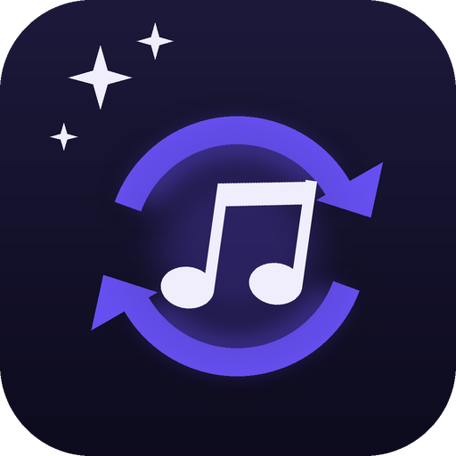

<div align="center">



# Soundswap

**Swap the game's music for your own songs, right in game.**

A Dalamud plugin for Final Fantasy XIV that turns your own audio files into a Penumbra music mod. Pick a song from the game, drop in yours, and Soundswap converts it, installs the mod and switches it on.

[](https://github.com/sleousis/Soundswap/releases/latest)
[](https://github.com/sleousis/Soundswap/releases)
[](LICENSE)

</div>

## Key features

- **Every song in the game, by name.** Search all of the game's music by name, place or file name. The names come from [Orchestrion](https://github.com/perchbirdd/OrchestrionPlugin)'s song list, read live when Orchestrion is installed, so new patches need no update from Soundswap.
- **Replace what's playing.** With Orchestrion installed, press **Replace** on the song playing right now, or type `/soundswap now`.
- **Any audio file.** Drop in MP3, WAV, OGG, FLAC, M4A, AAC, MP4, WMA, AIFF and more. Soundswap converts it to the format the game stores its music in.
- **Sounds like it belongs.** The volume is matched to the song it replaces, so your song is no louder or quieter than the game's. The loop comes from the file's own loop tags, or you set it yourself, and you can trim the start and end.
- **Layered songs too.** Some songs, most of them battle themes, have layers the game fades between during a fight. Each layer can get your song, silence, or the game's own layer.
- **Hear it before you build.** Preview the game's version, each of its layers, your song as it will play in game, and the loop seam.
- **One button to install.** **Build & install** puts the mod in Penumbra and switches it on in your current collection. With Orchestrion installed, it can play your song straight away. Building again updates the same mod.
- **Share it.** Export a `.pmp` that anyone can import into Penumbra.

## Requirements

- **[Penumbra](https://github.com/xivdev/Penumbra)** loads the mod. Without it, Soundswap can still export a `.pmp` for you to import later.

This one is optional.

- **[Orchestrion](https://github.com/perchbirdd/OrchestrionPlugin)** keeps the song names up to date, shows what is playing and plays your song in game after a build. Without it, Soundswap uses the song names it ships with.

## Installation

1. Install [XIVLauncher](https://github.com/goatcorp/FFXIVQuickLauncher) and start the game through it with Dalamud enabled.
2. In game, type `/xlsettings` and open the **Experimental** tab.
3. Under **Custom Plugin Repositories**, paste the link below into the empty field, press the **+** button, then **Save and Close**.

   ```
   https://raw.githubusercontent.com/sleousis/Soundswap/main/repo.json
   ```

4. Type `/xlplugins`, search for **Soundswap** under **All Plugins** and install it.

Please install Soundswap this way rather than from a release zip. Dalamud then keeps it up to date for you.

## Commands

| Command | What it does |
| --- | --- |
| `/soundswap` | Opens or closes Soundswap |
| `/soundswap now` | Adds the song playing right now to your mod (needs Orchestrion) |
| `/soundswap build` | Builds the mod and installs it in Penumbra |
| `/soundswap preview` | Plays your first song as the game will play it; again to stop |

## Before you use it

- **The game's files are never changed.** Your songs live in a Penumbra mod, so switching the mod off in Penumbra brings the game's music back.
- **Only share music you have the right to share.** A `.pmp` holds the songs you put in it.
- **A few songs can't do everything:**
  - The two Gridania town themes are stored in a different format. They can be replaced, but the game's version can't be previewed, and their own layers can't be kept.
  - The game's silent placeholder songs hold no audio, so there is nothing to replace.

## Support

Something not working? [Open an issue](https://github.com/sleousis/Soundswap/issues/new) with the song, the file you used, what you did and what happened. The lines under `/xllog` filtered on **Soundswap** help a lot.

## Contributing

Contributions are welcome. Please open an issue before writing any code, so we can agree on the change first.

Soundswap builds with the .NET 10 SDK against Dalamud API 15. The song conversion lives in `Soundswap.Core`, which does not depend on the game, and its tests run with `dotnet test`. Layered songs need the reference Vorbis encoder: run `tools\build-vorbis.cmd` once (it needs Visual Studio's C++ tools) to build it from Xiph's pinned sources.

## License

Soundswap is released under the [MIT License](LICENSE). It reads the game's music files the way [VFXEditor](https://github.com/0ceal0t/Dalamud-VFXEditor) does, takes its song names from [Orchestrion](https://github.com/perchbirdd/OrchestrionPlugin) and encodes with [libvorbis](https://xiph.org/vorbis/). See [THIRD_PARTY_NOTICES.md](THIRD_PARTY_NOTICES.md) for their licenses.
